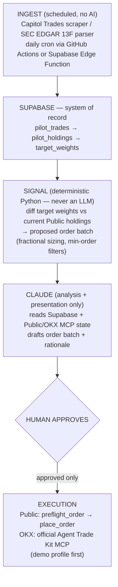

# Pilot Engine

Self-hosted, recommend-only copy-trading pipeline for public STOCK Act and 13F
disclosures. The engine computes deterministic target weights and proposed
orders for an experimental brokerage sleeve. It never executes an order without
fresh human approval.

## Architecture



Deterministic code makes every trading and sizing decision. An LLM may explain
or present a proposed batch, but it does not compute positions or authorize
execution.

## Non-negotiable guardrails

- Recommend-only by default; execution requires explicit, fresh human approval.
- Experimental sleeve: at most 5% of investable assets, with reassessment at
  10%.
- Single-name target: at most 3%; hard maximum: 5%.
- Stop contributions unless the sleeve beats VTI after all costs over 12–18
  months.
- Keep all credentials out of Git. OKX begins on a trade-only demo profile with
  withdrawals disabled.
- Vanguard and Fidelity credentials are never used by this project.

## Phase 0

Phase 0 provides the database migration, Python 3.12/`uv` tooling, Ruff linting,
and no-op scheduled workflows. Data ingestion, signal generation, and execution
remain intentionally unimplemented.

```bash
uv sync --locked
uv run ruff check .
uv run python ingest/normalize.py
```

Copy `.env.example` to `.env` only in a trusted local environment. Never commit
the resulting file. Store automation credentials in GitHub Secrets.
